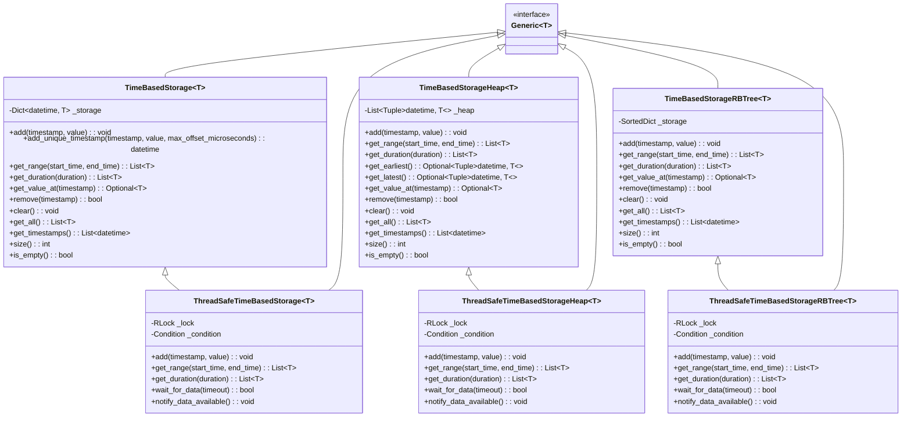

# Time-Based Storage Architecture

This document provides an overview of the architecture, design decisions, and implementation details of the time-based storage library.

## System Architecture

The library is organized with a clear separation of concerns:

```
time_based_storage/
├── core/
│   ├── __init__.py
│   ├── base.py        # Base implementation
│   ├── heap.py        # Heap-based implementation
│   └── rbtree.py      # Red-Black Tree implementation
└── concurrent/
    ├── __init__.py
    ├── thread_safe.py          # Thread-safe wrapper for base implementation
    ├── thread_safe_heap.py     # Thread-safe wrapper for heap implementation
    └── thread_safe_rbtree.py   # Thread-safe wrapper for RB-Tree implementation
```

## Class Hierarchy

The following diagram illustrates the class inheritance structure of the library:



### Core Components

1. **`TimeBasedStorage` (core/base.py)**
   - Stores events in a sorted structure
   - Optimized for range queries
   - Maintains chronological order

2. **`TimeBasedStorageHeap` (core/heap.py)**
   - Uses Python's heapq module for efficient insertion
   - Optimized for accessing the earliest event
   - Maintains partial ordering based on timestamps

3. **`TimeBasedStorageRBTree` (core/rbtree.py)**
   - Uses Red-Black Tree implementation through SortedDict
   - Balanced for both insertion and range queries
   - Maintains full ordering with efficient operations

### Concurrent Components

1. **`ThreadSafeTimeBasedStorage` (concurrent/thread_safe.py)**
   - Thread-safe wrapper around TimeBasedStorage
   - Uses locks to ensure thread safety
   - Provides waiting/notification mechanism

2. **`ThreadSafeTimeBasedStorageHeap` (concurrent/thread_safe_heap.py)**
   - Thread-safe wrapper around TimeBasedStorageHeap
   - Uses locks to ensure thread safety
   - Maintains the efficiency of the underlying heap

3. **`ThreadSafeTimeBasedStorageRBTree` (concurrent/thread_safe_rbtree.py)**
   - Thread-safe wrapper around TimeBasedStorageRBTree
   - Uses locks to ensure thread safety
   - Preserves the balanced performance characteristics of the RB-Tree

## Design Decisions

### 1. Implementation Variants

Three different implementations were created to support different access patterns:

- **Dictionary-based implementation**: Prioritizes efficient range queries and timestamp lookups, with O(1) for lookups but O(n) for insertions.
- **Heap-based implementation**: Prioritizes efficient insertion and earliest event access, with O(log n) complexity for insertions but O(n log n) for range queries.
- **Red-Black Tree implementation**: Provides balanced performance with O(log n) for both insertions and range queries, making it suitable for a wide range of use cases.

This allows users to choose the implementation that best matches their access patterns.

### 2. Generics Support

The library uses Python's generic typing to allow storing any type of data:

```python
storage = TimeBasedStorage[int]()  # Store integers
storage = TimeBasedStorage[str]()  # Store strings
storage = TimeBasedStorage[dict]() # Store dictionaries
```

This provides flexibility while maintaining type safety.

### 3. Thread Safety as a Wrapper

Thread safety is implemented as wrappers around the base implementations rather than being built into the core classes. This architecture:

- Keeps the core implementations simple and focused
- Allows users to choose between thread-safe and non-thread-safe variants
- Separates concurrency concerns from data structure logic
- Makes the code easier to test and maintain

### 4. Timestamp Collision Handling

The library provides explicit handling for timestamp collisions:

- By default, `add()` will raise a ValueError if a timestamp collision occurs
- `add_unique_timestamp()` method automatically adjusts timestamps to ensure uniqueness

This approach allows users to decide how to handle conflicts rather than silently adopting a strategy.

## Implementation Details

### Storage Backend

The implementations use different data structures:

1. **TimeBasedStorage**:
   - Uses a dictionary (`self._storage`) for O(1) lookup by timestamp
   - Uses sorted key iteration for range queries

2. **TimeBasedStorageHeap**:
   - Uses a binary min-heap for fast insertion and earliest event access
   - Uses a dictionary for direct timestamp lookup

3. **TimeBasedStorageRBTree**:
   - Uses a SortedDict from the sortedcontainers package
   - Provides O(log n) operations for most operations
   - Enables efficient range queries through key slicing operations

### Thread Safety Implementation

Thread safety is achieved using Python's threading primitives:

1. **ReentrantLock**: Used to protect shared data structures
2. **Condition Variables**: Used for wait/notify mechanism
3. **Local storage**: Used to prevent race conditions

Performance considerations:
- Fine-grained locking where possible
- Minimized critical sections
- Read operations can proceed concurrently

### Error Handling

The library follows these error handling principles:

1. **Explicit errors**: Raises specific exceptions rather than returning error codes
2. **Validation**: Input parameters are validated early
3. **Idempotent operations**: Some operations are designed to be safely repeated
4. **Clear error messages**: Error messages clearly indicate the issue

## Performance Characteristics

### TimeBasedStorage

- **Space complexity**: O(n) where n is the number of stored events
- **Time complexity**:
  - Insertion: O(n) due to maintaining sorted order
  - Lookup by timestamp: O(1)
  - Range queries: O(n) linear scan through sorted dictionary keys
  - Iteration: O(1) for accessing all events

### TimeBasedStorageHeap

- **Space complexity**: O(n)
- **Time complexity**:
  - Insertion: O(log n) using heapq
  - Lookup by timestamp: O(1) using dictionary
  - Range queries: O(n log n)
  - Earliest event access: O(1)

### TimeBasedStorageRBTree

- **Space complexity**: O(n)
- **Time complexity**:
  - Insertion: O(log n) using Red-Black Tree
  - Lookup by timestamp: O(log n)
  - Range queries: O(log n + k) where k is the number of items in range
  - Iteration: O(1) for accessing all events
  - Benchmark results: Up to 470x faster for small targeted range queries

## Testing Strategy

The library employs a comprehensive testing strategy:

1. **Unit tests** for individual components
2. **Integration tests** for component interactions
3. **Concurrency tests** for thread-safe variants
4. **Stress tests** to ensure performance under load
5. **Edge case tests** for boundary conditions
6. **Benchmark tests** to compare performance between implementations

## Future Improvements

Potential areas for enhancement:

1. **Persistence**: Add support for saving/loading from disk
2. **Advanced indexing**: Support for multiple indexes beyond timestamp
3. **Event expiration**: Automatic removal of old events
4. **Batch operations**: Optimized bulk operations
5. **Distributed storage**: Support for distributed deployment
6. **Time zone handling**: Better support for time zone conversions
7. **Compression**: Data compression for large datasets 